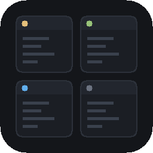
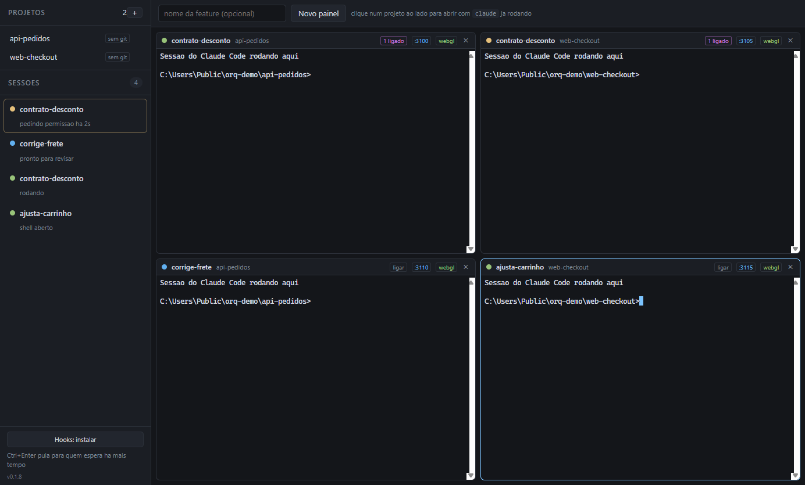

# Orquestrador de CLIs

**Várias sessões do Claude Code ao mesmo tempo, numa grade, ordenadas por quem está te esperando.**

<br clear="left">



## O que ele resolve

Três coisas que nenhuma ferramenta entrega juntas:

- **Ver todos os terminais ao mesmo tempo**, numa grade — não uma sessão por vez com lista lateral.
- **Saber na hora qual sessão parou te esperando**, e há quanto tempo. A bolinha fica amarela sozinha,
  em menos de 100ms, mesmo com o painel fora da tela.
- **Misturar projetos diferentes no mesmo painel**, ordenados por urgência e não por repositório.

Cada sessão roda no seu próprio worktree, com sua própria faixa de portas. Duas features do mesmo
projeto não brigam pelos arquivos nem pela porta 3000.

---

## Instalar

> **Baixe o ZIP, não o `.exe`.** O instalador não é assinado, e o Controle Inteligente de Aplicativos
> do Windows 11 bloqueia instaladores sem assinatura — sem opção de contornar. O ZIP não passa por
> isso. Detalhes em [docs/instalacao-e-assinatura.md](docs/instalacao-e-assinatura.md).

1. Baixe o **`Orquestrador-X.Y.Z-portatil.zip`** na
   [página de releases](https://github.com/Rafadegolin/cli-orchestrator/releases/latest).

2. **Antes de extrair, desbloqueie o arquivo:** botão direito no ZIP → Propriedades → marque
   **Desbloquear** → OK.

   Este passo é o que importa. Extrair sem desbloquear marca os arquivos como vindos da internet, e
   aí o Windows implica com eles.

3. Extraia para onde quiser, por exemplo `C:\Ferramentas\Orquestrador`.

4. Rode **`Orquestrador.exe`**. Se quiser atalho no menu iniciar, crie um manualmente.

Na primeira vez, **F1** abre o manual completo dentro do próprio app.

Requisitos: Windows 10 ou 11, e o [Claude Code](https://claude.com/claude-code) instalado e
autenticado. O app não precisa de Node.

### Ligue os hooks na primeira vez

No rodapé da barra lateral há o botão **Hooks: instalar**. Ele registra no seu
`~/.claude/settings.json` os avisos que fazem as bolinhas mudarem sozinhas.

O app pergunta antes, faz backup do arquivo e preserva o que já estiver lá. Sem os hooks o app
funciona, mas os status ficam parados — e é justamente o status que faz a grade valer a pena.

---

## Usando

**Cadastre um projeto.** No `+` da seção PROJETOS, escolha a pasta do repositório. Ela fica salva.

**Abra uma sessão.** Digite o nome da feature no campo de cima e clique no projeto. O painel abre na
pasta certa e sobe `claude -w nome-da-feature`, que cria o worktree isolado. Sem nome de feature, abre
`claude` direto na pasta do projeto.

**Retome o trabalho de ontem.** A seta ao lado do projeto lista os worktrees existentes. Um clique
abre o painel dentro dele continuando a última conversa. A etiqueta diz o que impede arquivar cada
um — `aberto agora`, `2 alterados`, `1 commit` — e o `×` arquiva os que estão limpos, removendo pasta
e branch.

**Ligue sessões de repositórios diferentes.** Uma feature que mexe no backend e no frontend ao mesmo
tempo: o botão `ligar` no cabeçalho do painel dá a cada sessão acesso ao código da outra. Elas param
de reexplicar o contrato da API uma para a outra.

**Atenda a fila.** `Ctrl+Enter` pula direto para a sessão que está esperando há mais tempo e põe o
cursor lá. Quando o app não está em primeiro plano, você recebe notificação do sistema.

**Aprove sem entrar no terminal.** Quando o Claude pede permissão, a pergunta aparece no rodapé do
painel com os botões **Aprovar** e **Ver**. Aprovar responde "1. Yes" ao pedido que está na tela —
nunca "não perguntar mais", e nunca às cegas: se o app não achar o pedido no terminal, ele não
escreve nada e leva você até lá.

**Feche sem medo.** O arranjo é salvo. Ao reabrir, os painéis voltam adormecidos com um botão de
retomar — e um "Retomar todas" na lateral.

### Ajuda dentro do app

**F1**, ou o botão **Ajuda** no rodapé da lateral. É o manual completo — cada recurso, os atalhos, as
portas, os hooks e uma seção de problemas comuns com sintoma e causa.

Os números que ela cita (portas, limites, caminho da pasta de dados) são lidos do app em execução, não
copiados à mão, então não envelhecem quando o código muda.

### Portas

Cada painel recebe **5 portas livres** a partir da 3100, exportadas como `PORT`, `ORQ_PORTA` e
`ORQ_PORTAS`. A porta aparece no cabeçalho do painel.

Para o seu projeto usá-las, ele precisa ler a variável:

| Stack | O que fazer |
|---|---|
| Next | `next dev` já respeita `PORT`. Se houver `-p 3001` fixo no script, ele vence a variável e precisa sair. |
| Vite | Ignora `PORT`. Use `vite --port %PORT%`, ou `server: { port: Number(process.env.PORT) \|\| 5173 }`. |
| Nest / Express | Garanta `app.listen(process.env.PORT ?? 3000)`. |
| Turborepo | Cada app pega uma posição de `ORQ_PORTAS`. |

### Arquivos que o worktree não leva

Um worktree é um checkout limpo: o `.env` não vai junto, e sem ele a aplicação não sobe. Quando o app
detecta essa situação, oferece criar um `.worktreeinclude` listando o que copiar.

---

## Atualizar

O app avisa quando sai versão nova. Na versão portátil ele não aplica sozinho — o botão abre a página
da release. Baixe o ZIP novo, desbloqueie, extraia por cima.

Seus dados não ficam na pasta do app: projetos, sessão e configuração moram em `~/.orquestrador`, e
não se perdem ao substituir a pasta.

---

## Desenvolvimento

```bash
npm install
npx install-electron        # o Electron 43 nao baixa o binario sozinho
npm start                   # roda o app
npm run dev                 # roda com a porta de depuracao, para os testes
npm run empacotar           # gera instalador e zip em dist/
```

Os testes dirigem o app de fora via CDP, sem instrumentar o código de produção. Suba com
`npm run dev` antes de rodar qualquer um — e **uma instância por vez**.

```bash
npm run teste:fase1         # PTY, lote de IPC, resize, enxurrada
npm run teste:fase2         # grade, orcamento de WebGL, RAM e CPU
npm run teste:fase45        # hooks, bolinhas, ordenacao por urgencia
npm run teste:fase6         # painel fora da tela, fila de partida
npm run teste:fase7         # sessao salva, painel dormindo, retomar
npm run teste:projetos      # cadastro e comando inicial
npm run teste:portas        # dois servidores no ar ao mesmo tempo
npm run teste:worktrees     # listar, recusar e arquivar
npm run teste:ajuda         # a ajuda, e se os numeros dela batem com o codigo
npm run teste:ligacoes      # mecanica das ligacoes
npm run diagnostico         # por que o Windows bloqueou o instalador
npm run perfil              # CPU e RAM por processo
```

- [`docs/orquestrador-clis-documentacao.md`](docs/orquestrador-clis-documentacao.md) — a
  especificação de construção, com as metas de performance e o raciocínio de cada decisão.
- [`docs/fase-9-extras.md`](docs/fase-9-extras.md) — o que ainda pode ser feito.
- [`docs/instalacao-e-assinatura.md`](docs/instalacao-e-assinatura.md) — o bloqueio do Windows,
  por que acontece e as opções.
- [`CLAUDE.md`](CLAUDE.md) — invariantes e armadilhas para quem for mexer no código.
